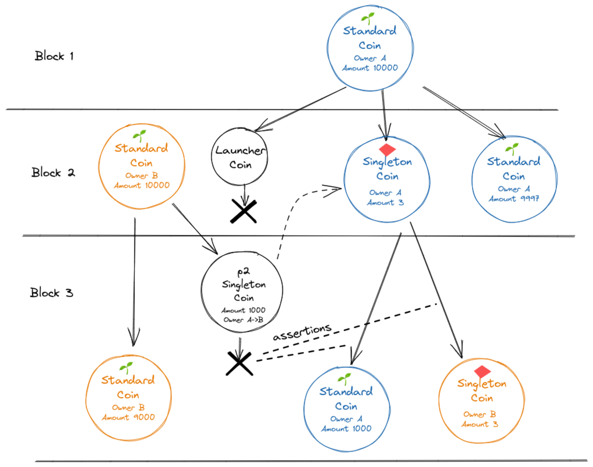

# Puzzles

These puzzles are used to construct singletons with an owner and paid transfer capabilities.

The following image shows an overview of a singleton transfer.

## ownable_singleton

This is an inner puzzle for a singleton_top_layer coin. It allows the singleton to be owned by a public key.

Furthermore, the ownership can be transferred to a new owner, optionally by paying for it in XCH.
The payment is done via a special p2_singleton_or_cancel coin.

## p2_singleton_or_cancel

This coin can be spent in order to pay for a singleton ownership transfer.
It also has a cancel functionality, in case an offer should be cancelled.
